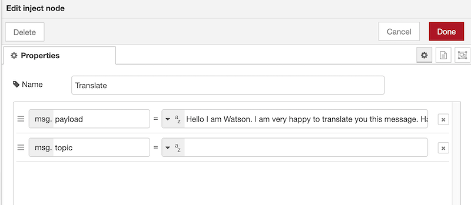
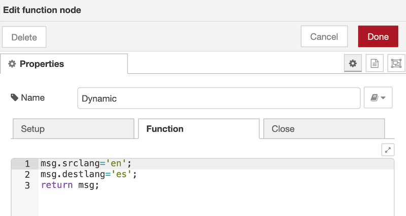
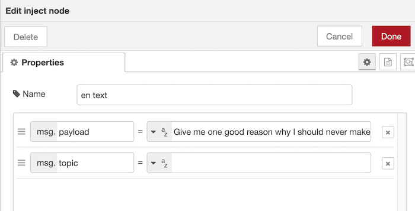
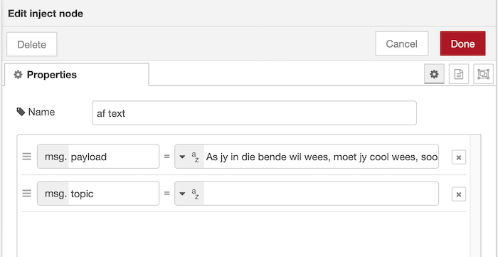
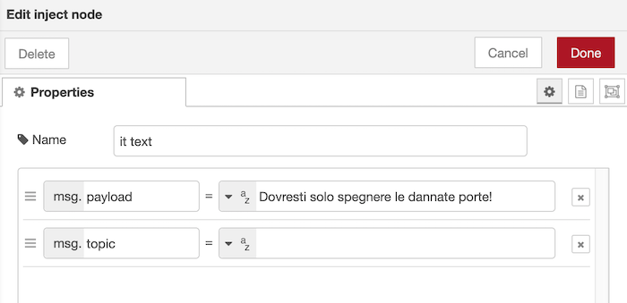

## Overview 


IBM Watson™ Language Translator can identify the language of text and translate it into different languages programmatically.

The service offers multiple IBM-provided translation models that you can customize based on your unique terminology and language. Use Language Translator to take news from across the globe and present it in your language, 
communicate with your customers in their own language, and more.


## Node-RED Watson Language Translator nodes 


These nodes provide a set of easy wrapper nodes to

* translate text within a domain or
* Identify the language of a text

The service will also provide a confidence level of it's result.

## Translator Flow 

In this example some text (in English in this case) is injected, translated (to French) and put the result to the Debug tab. Add onto the canvas an inject node, language translator node and debug node. In the following screenshot you can see how the nodes are configured.


 

For the Inject node, in the payload, enter some text. You can use any text for this node. As an example:
`Hello I am Watson. I am very happy to translate you this message. Have a lovely day. Bye.`


**Tip** : use double quotes for terms you do not want to be translated by Watson.


 


For the language translator node, if you choose to use the example text then set the node parameters to:

* Mode = Translate
* Domains = General
* Source = English
* Target = French

However if you have chosen text in a different language, or wish to translate into a different language, then edit the source and target.

 

Edit the debug node. As the translated text will be returned on msg.payload, make sure that you are looking for this in the Debug node.

 

## This completes the first part of the flow. If you deploy and initiate the inject node, you will see the translation in the debug tab.   

### Dynamic Configuration

Start by duplicating the original inject node (copy + paste).

 

Add a function node and enter the following code:
```JAVASCRIPT
msg.srclang = 'en';
msg.destlang = 'es';
return msg;
```

This will translate your text from English to Spanish.

 

### Link the function node back to the Language Translator node. Deploy and initiate the inject node.


## The Identify flow


This example will have 3 inputs with different languages. The language identify flow should look like

### en text inject node
Add an inject node to the canvas. Double-click the node, then change the name to identify the block. Change the input type to string and add your required text. For example:

> Give me one good reason why I should never make a change



### af text inject node
Add another inject node to the canvas. Double-click the node, then change the name to identify the block, change the input type to string and add your required text. As an example, Afrikaans text:

> As jy in die bende wil wees, moet jy cool wees, soos pappa!

)

### it inject node
Add another inject node to the canvas. Double-click the node, then change the name to identify the block, change the input type to string and add your required text. As an example, Italian text:

> Dovresti solo spegnere le dannate porte!

)


### Add the Language Identification node
Drag and drop a Language Identification node from the nodes palette, and wire it to your input node. It does not require any modification.

### Add first debug node
Drag and drop a debug node from the nodes palette, and wire it to your Language Identification node. Double-click the node, then change the output to msg.lang. This will give you primary language identified.

### Add second debug node
Drag and drop a debug node from the nodes palette, and wire it to your Language Identification node. Double-click the node, then change the output to msg.languages. This will give you an array of all languages identified in order of the confidence level


 ### Deploy and initiate the inject nodes
 
#### You can use the [Listing identifiable languages](https://cloud.ibm.com/docs/language-translator?topic=language-translator-identifiable-languages) link to compare your ouput.
