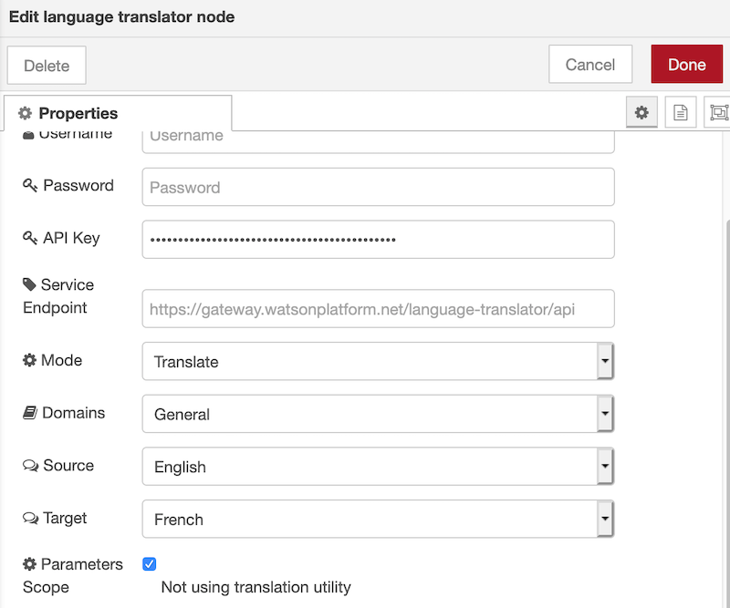
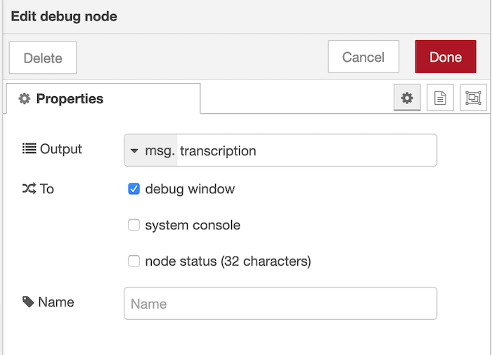

## Overview 

IBM Watson™ Language Translator can identify the language of text and translate it into different languages programmatically.

The service offers multiple IBM-provided translation models that you can customize based on your unique terminology and language. Use Language Translator to take news from across the globe and present it in your language, 
communicate with your customers in their own language, and more.

## Node-RED Watson Language Translator nodes 

These nodes provide a set of easy wrapper nodes to

* translate text within a domain or
* Identify the language of a text

The service will also provide a confidence level of it's result.

## Translator Flow 

In this example some text (in English in this case) is injected, translated (to French) and put the result to the Debug tab. Add onto the canvas an inject node, language translator node and debug node. In the following screenshot you can see how the nodes are configured.

 

For the Inject node, in the payload, enter some text. You can use any text for this node. As an example:
`Hello I am Watson. I am very happy to translate you this message. Have a lovely day. Bye.`

**Tip** : use double quotes for terms you do not want to be translated by Watson.

 

For the language translator node, if you choose to use the example text then set the node parameters to:

* Mode = Translate
* Domains = General
* Source = English
* Target = French

However if you have chosen text in a different language, or wish to translate into a different language, then edit the source and target.

 

Edit the debug node. As the translated text will be returned on msg.payload, make sure that you are looking for this in the Debug node.

 

