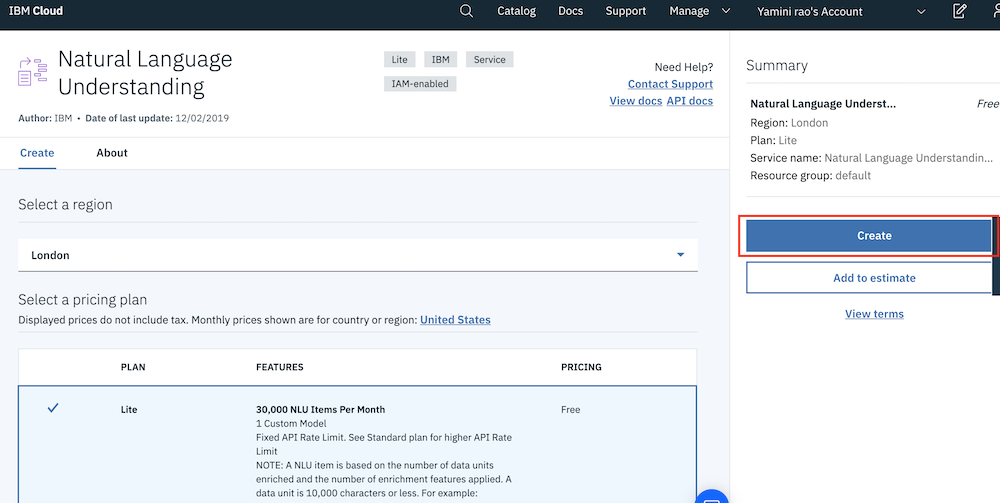
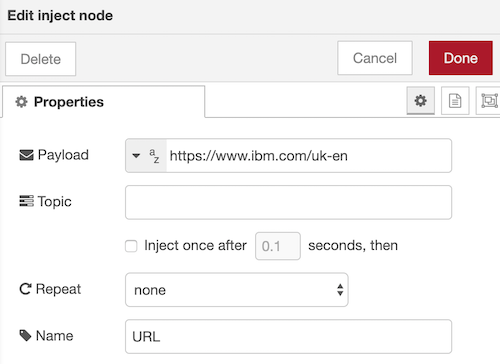
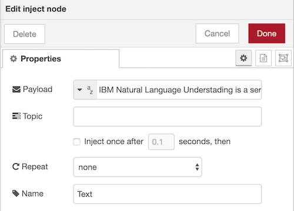
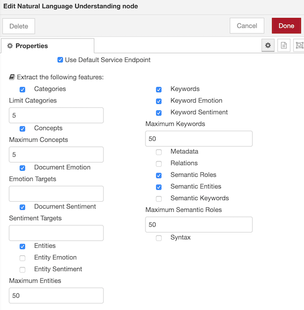

## Overview
Natural Language Understanding enables advanced text analysis through natural language processing. The service analyzes unstructured text to extract metadata such as entities, general concepts, keywords, categories, relations, sentiment, and emotion. 

## Node-RED Watson NLU node

The Node-RED  Node provides an easy to use wrapper that you can extract meta-data from content. You can analyse external URLs, HTML files or text content.


#### In this exercise we will show you how to use the node to extract data from a webpage and simple text.

### Setup 

Similar to the previous workshop, search for 'natural language understanding' in your IBM cloud dashboard and click create 



#### Copy your API credentials to use in Node-RED

### Building the Flow  

Add the following nodes from the palette to your flow canvas.
*	Two Inject nodes.
*	A Natural Language Understanding node.
* A Debug node.

### Flow Wiring

Wire the nodes together to look like this 

# 

### Configuring the nodes

The first Inject node is used to inject a URL into the flow. This example uses the standard IBM UK site. https://www.ibm.com/uk-en


# 

The second inject node will be used to inject text into the flow. Any text can be used, for example:

``` IBM Natural Language Understading is a service on IBM Cloud that enables you to analyze text ```

 


Configure the Natural Language Understanding node for the service features that you want to detect. As you select the items you require, the node menu will expand with additional options.


